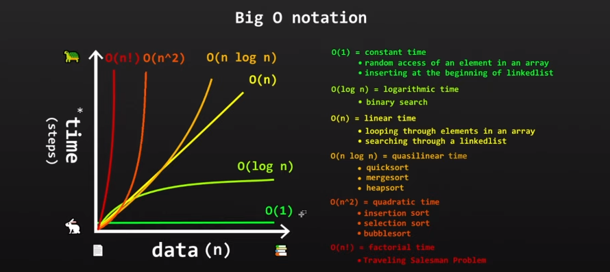

## Big O notation

> "How code slows as data grows."

1. Describes the performance of an algorithm as the amount of data increases;
2. Machine independent (number of steps to completion);
3. Ignore smaller operations O(n + 1) -> O(n)

Example:

```
  O(1) # Constant time
  O(n) # Linear time
  O(log n) # Logarithmic time
  O(n log n) # Quasilinear time
  O(n^2) # Quadratic time
  O(n!) # Factorial time
```

n = amount of data (it's a variable like x)

### O(1) - Constant time

When the algorithm will always run at the same time, regardless of the amount of data it receives.

```go
  func AddUp(n int) {
    sum = n * (n + 1) / 2

    return sum
  }
  // n = 1000000
  // 3 steps
```

### O(n) - Linear time

When the time of algorithm is dependent on the value of n (n = input data).

```go
  func AddUp(n int) {
    sum := 0
    for(index := 0; index <= n; index++ ) {
      sum += index;
    }

    return sum
  }
  // n = 1000000
  // ~1000000 steps
```

<figure>
  

  <figcaption>Big O time complexity chart</figcaption>
</figure>
